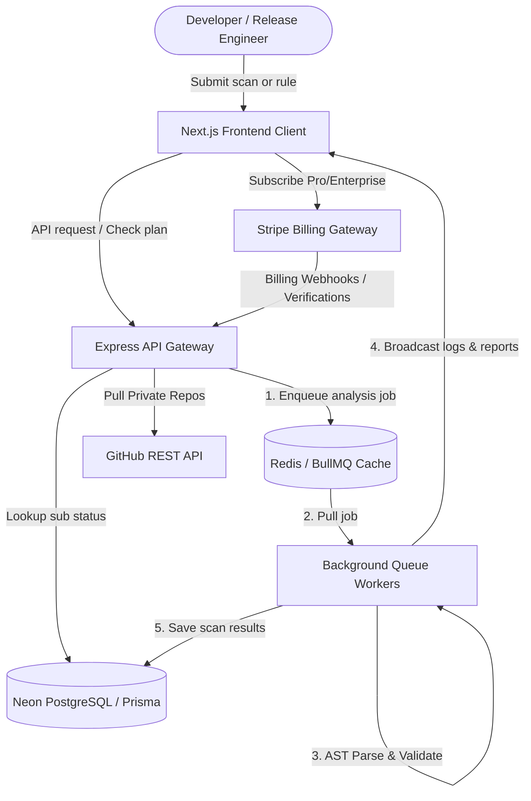

# DeployGuard 🛡️ — Enterprise Salesforce CI/CD Static Analysis & DevSecOps Platform

DeployGuard is an advanced, production-grade **Salesforce CI/CD Pipeline Static Analysis and Compliance Engine**. Built with React, Next.js, Node.js, and Redis (BullMQ), it parses deployment configurations (like GitHub Actions, GitLab CI, and Jenkins) to detect security vulnerabilities, metadata anomalies, hardcoded secrets, and destructive changes before they hit production.

Specifically optimized for **Salesforce release management**, it serves as a high-performance DevSecOps checkpoint to prevent deployment failures and enforce compliance policies automatically.

---

## 🏗️ System Architecture & Workflow

Below is the conceptual architecture showing how the Next.js frontend, Express API Gateway, BullMQ background queues, WebSockets, Prisma, and Stripe integrate:



---

## 🌟 Key Capabilities

### 1. Salesforce-Specific DevSecOps Engine
* **Apex Static Analysis**: Validates deploy tasks for required test levels (e.g., enforcing `RunLocalTests` or `RunSpecifiedTests` on production deploys).
* **Metadata Integrity**: Scans deployment manifests for unvalidated custom settings, unreferenced metadata profiles, and security exceptions.
* **Destructive Changes Safety Checks**: Blocks pipeline runs containing unvalidated `destructiveChangesPre.xml` or `destructiveChangesPost.xml` files that could delete production data.

### 2. Custom Security Compliance Rule Builder (Enterprise)
* Enforces corporate policies at scale. Administrators can register custom violating substrings (e.g., blocking `allow-failures: true` or testing environment flags like `env: PROD` on unauthorized branches).
* Dynamic evaluations are injected into the AST scan parser in real-time.

### 3. AI-Assisted Auto-Remediation (Click-to-Fix)
* When an analysis runs and detects vulnerabilities (e.g., hardcoded passwords or AWS keys), the app presents an **AI Autofix** button.
* Clicking it instantly rewrites the violating code in the YAML editor to use secure credentials (like `${{ secrets.SF_PASSWORD }}`) on-the-fly.

### 4. Direct Stripe Billing & Webhook Fallback
* Integrates **Stripe Checkout** for Pro and Enterprise subscriptions.
* **Local Verification Fallback**: Includes a custom session verification query pattern (`/verify-session`) that resolves Stripe Checkout sessions directly via the Stripe SDK. This enables developers to test payments end-to-end locally without needing public webhook tunnels (like ngrok).
* **Developer Bypass Mode**: Restricted admin endpoint `/grant-dev-license` allows the registered developer email (`ytannu1410@gmail.com`) to instantly bypass Stripe and activate a 10-year Enterprise test subscription.

### 5. SOC2 & ISO27001 Compliance Audits
* Generates audit logs containing pipeline scan status, critical findings, and remediation history.
* Enterprise users can download these audit logs with a single click to present directly to auditors.

---

## 🛠️ Technology Stack

* **Frontend**: Next.js 16 (Turbopack, App Router), Tailwind CSS v4, Framer Motion (animations), Recharts (analytics visualization).
* **Backend**: Node.js, Express, WebSockets (`ws` for real-time log streaming), TypeScript.
* **Task Queue**: BullMQ, IORedis (handling background worker threads).
* **Database**: Neon Serverless PostgreSQL, Prisma ORM.
* **Payments**: Stripe Node SDK, Stripe Elements.

---

## 🚀 Local Installation & Setup

Ensure you have **Node.js (v18+)** and a local **Redis** instance running.

### 1. Environment Configurations
Create a `.env` file inside the `backend` folder:
```env
PORT=3001
REDIS_HOST=localhost
DATABASE_URL="your-postgresql-database-connection-url"
STRIPE_SECRET_KEY="your-stripe-sk-key"
STRIPE_PUBLISHABLE_KEY="your-stripe-pk-key"
FRONTEND_URL="http://localhost:3000"
```

### 2. Setup the Backend Server
```bash
cd backend
npm install
npx prisma generate
npx prisma db push
npm run dev
```
*The API gateway and WebSocket server will boot up on `http://localhost:3001`.*

### 3. Setup the Next.js Frontend
```bash
cd ../frontend
npm install
npm run dev
```
*The client dashboard will start up on `http://localhost:3000`.*

---

## 💼 DevSecOps Relevance (AutoRABIT Alignment)
This project represents standard production challenges faced in modern Salesforce Release Management:
1. **Pipeline Optimization**: Ensuring deployment workflows are validated before execution, saving expensive cloud compute costs and runner overheads.
2. **Shift-Left Security**: Automating static analysis audits early in the commit lifecycle, minimizing manual code reviews.
3. **Enterprise Billing & Custom Rules**: Designing modular subscription architectures with multi-select scanning rules matching real-world organizational security boundaries.
